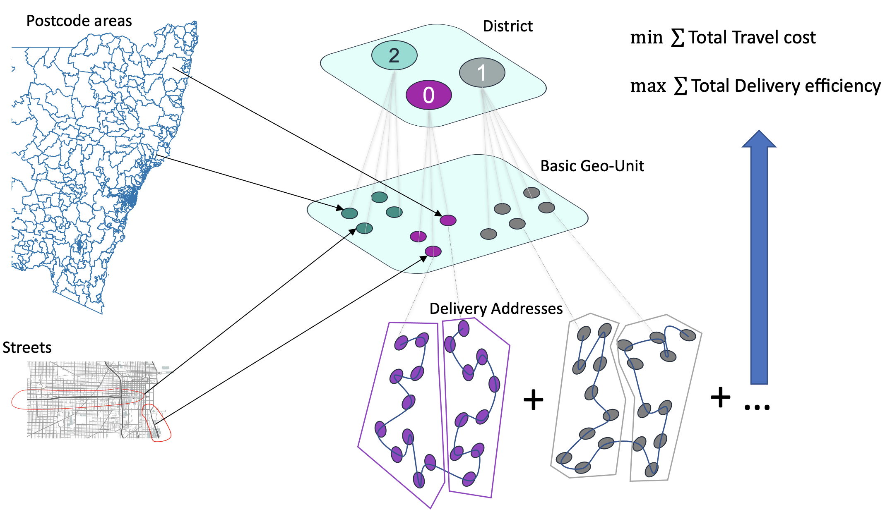

# AWS District Optimization for Last Mile Planning

This repository demonstrates our solution to the district optimization problem for package allocation and [last mile planning](https://en.wikipedia.org/wiki/Last_mile_(transportation)). In our approach, we assemble basic geographic units, such as streets, post code areas, suburbs, into larger geographic districts known as **polygons**, in order to achieve some optimisation objectives or planning criteria. Packages are automatically allocated to different polygons based on the spatial matching between their addresses and the [geo-fence](https://en.wikipedia.org/wiki/Geo-fence) of the established polygons. Our solution runs on SageMaker notebook instances.



## Installation

```bash
# Create the conda virtual environment
conda create --name pa-opt python=3.8
conda activate pa-opt
pip install -r requirements.txt
```

## Quick Start
Going through Step 1 to Step 7 by running the following terminal commands on a SageMaker notebook instance. Step 2 and Step 3 can also be integrated as a SageMaker processing job.
```bash
# download data and prepare the basic geo-units
python 01_data_download_bgu.py

# follow instructions on 02_launch_vahalla.md to setup Vahalla API

# generate distance matrix
python 03_gen_dist_matrix.py

# generate the graph
python 04_gen_graph.py

# perform graph partitioning
python 05_graph_partition.py

# produce data for evaluation
python 06_eval_prep.py

# evaluation
python 07_evaluate.py
```

## License
This project is licensed under the Apache-2.0 License.

## Acknowledgements
* https://github.com/kw/metis-python (MIT License)
* https://github.com/KarypisLab/METIS (Apache-2.0 License)
* https://github.com/google/or-tools (Apache-2.0 License)
* https://github.com/valhalla/valhalla (MIT License)
